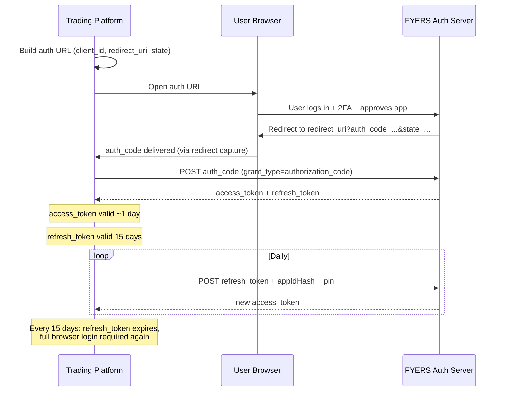
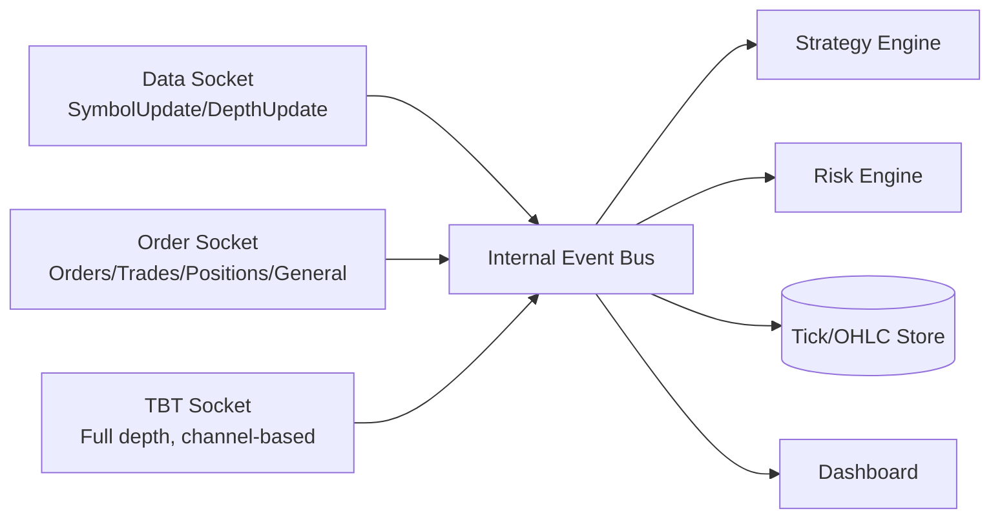

# FYERS API v3 — Technical Analysis & Architecture Foundation

**Purpose:** This document consolidates what is documented and verifiable about FYERS API v3, distinguishes it clearly from recommendation/assumption, and lays the foundation for building a production options trading platform for Indian markets.

**Important caveat up front:** `https://myapi.fyers.in/docsv3` is a JavaScript single-page application. It cannot be crawled/rendered directly by an automated fetcher (returns an empty shell). Everything below was reconstructed from: the official `fyers-apiv3` Python SDK README/source (PyPI/Socket.dev mirrors), FYERS' own release-notes blog post for v3.0.0, FYERS support-portal knowledge-base articles, and a large number of first-hand developer reports on the FYERS community forum showing real request/response payloads and real error codes. Anywhere I could not corroborate a claim from at least one of those sources, I've flagged it as **UNCONFIRMED / recommend validating live** rather than guessing. Nothing below is invented.

---

## 1. API Overview

**Documented facts:**
- FYERS API v3 is free of subscription fees — no charges for API access itself.
- Two transport styles: REST (HTTPS) for account/order/data operations, and WebSocket for streaming (three separate sockets — see §4).
- Official SDKs exist for Python (`fyers-apiv3`), Node.js/JavaScript, and .NET/C#, plus raw REST is usable from any language.
- v3 claims order execution latency under 50ms at the exchange-facing layer.
- Asset classes reachable through the API mirror what a FYERS trading account can access: NSE/BSE equities, NSE/BSE/MCX F&O (futures & options), currency derivatives, and commodities — gated by what segments are enabled on the user's underlying trading account, not by the API itself.
- v2 → v3 REST endpoints changed paths; request/response payload shapes were kept largely compatible, but WebSocket and SDK usage changed substantially (new Data Socket, new Order Socket).

**Important note from the docs/community:** the API surface (what you can call) is a function of your **live FYERS trading account's** exchange/segment permissions. The API layer does not grant additional access beyond what the account already has (e.g., F&O trading must be enabled on the account before F&O orders will succeed).

---

## 2. Authentication

### Documented flow (OAuth-style Authorization Code Grant)

1. **App registration** — created at `https://myapi.fyers.in/dashboard/`. You provide an App Name and a **Redirect URI** (any URL you control or a placeholder like a Google URL for testing). On creation you receive:
   - `client_id` (a.k.a. **App ID**, format like `XCXXXXXxxM-100`)
   - `secret_key` (a.k.a. **Secret ID**)

2. **Step 1 — Generate auth code URL.** Using the SDK's `SessionModel` (or the raw REST equivalent) with `client_id`, `secret_key`, `redirect_uri`, `response_type="code"`, `grant_type="authorization_code"`, and a `state` value (session/CSRF token echoed back to you), you generate a login URL and open it in a browser.

3. **Step 2 — User logs in** to their FYERS trading account (credentials + 2FA — FYERS supports TOTP-based external 2FA configured separately in "Manage Account"), approves the app/permissions, and is redirected to your `redirect_uri` with an `auth_code` query parameter (and your echoed `state`).

4. **Step 3 — Exchange auth code for access token.** POST the `auth_code` (via `session.set_token()` + `session.generate_token()` in the SDK) to receive an `access_token`.

5. **Step 4 — Refresh flow.** Endpoint: `POST https://api-t1.fyers.in/api/v3/validate-refresh-token`. Required body:
   ```json
   {
     "grant_type": "refresh_token",
     "appIdHash": "<sha256 hex of client_id + secret_key concatenated as a string>",
     "refresh_token": "<refresh_token>",
     "pin": "<user's 4-digit trading PIN>"
   }
   ```
   This returns a fresh `access_token` **without** requiring a full browser login — but it **requires the account PIN**, so it cannot be run as a fully unattended process unless the PIN is stored (a real security trade-off — see §12).

### Token lifetimes (documented / consistently reported)
- **Access token:** valid for **1 trading day** (must be regenerated daily — FYERS invalidates it at a fixed daily reset, not exactly 24h from issuance based on multiple forum reports; treat it as "valid until end of day / early morning reset" and always test for expiry rather than assuming a fixed TTL).
- **Refresh token:** valid for **15 days**.
- There is **no documented endpoint to regenerate a refresh token itself** before it expires — once it expires, the full authorization-code (browser login) flow must be repeated. This is a real operational constraint for a "fire and forget" server: **full re-authentication is required at least every 15 days**, and full non-interactive automation of that (auto-filling login + TOTP + PIN) is something you build yourself, not something FYERS provides as an API.

### Auth format for API calls
- The SDK expects/produces a combined token string in the form `"{client_id}:{access_token}"` for `FyersModel` and both WebSocket clients.

### Known rough edges reported by developers (worth building around)
- A community-reported bug: the `appIdHash` value is **not actually validated** server-side on the refresh endpoint (any string can appear to "work" in some reports) — do not treat this as a real security boundary; always compute it correctly regardless.
- Several developers report the refresh token **not being invalidated/rotated on reuse** — again, don't rely on this being enforced; write your own single-refresh-token, single-writer logic to avoid race conditions between multiple processes refreshing simultaneously.
- Common auth error `code: -371` = "Please provide sha256 hash of appId and app secret" (malformed/missing `appIdHash`).

### Best practices (recommendation, not documentation)
- Never hardcode `secret_key`, `access_token`, `refresh_token`, or PIN — use environment variables / a secrets manager.
- Persist tokens with **restrictive file permissions** or in an encrypted store (e.g., OS keyring, Vault), not plaintext `.txt` files (which is what most sample code on the forum does — explicitly a bad practice to avoid).
- Build a **token-refresh scheduler** that proactively refreshes well before expiry and has a fallback path that pages a human when full re-auth (15-day refresh-token expiry) is required.

### Login flow (sequence)



---

## 3. REST APIs

Base hosts observed in real traffic: `https://api-t1.fyers.in/...` (trading/auth) and `https://api.fyers.in/...` (some endpoints, versioned e.g. `/api/v3/...`). Treat both as legitimate FYERS-owned hosts; **configure the base URL, don't hardcode a single host**, since FYERS has moved endpoints between hosts across versions.

All authenticated REST calls need header `Authorization: {client_id}:{access_token}`.

| Endpoint (SDK method) | Purpose | Suitable for |
|---|---|---|
| `get_profile()` | User profile info | Live/paper |
| `funds()` | Available margin/funds by segment | Live/paper, risk checks |
| `holdings()` | Long-term equity holdings | Portfolio module |
| `tradebook()` | Executed trades for the day | Live reconciliation |
| `orderbook()` | All orders + statuses for the day | Live reconciliation |
| `positions()` | Open positions (day + carry-forward) | Live, risk |
| `place_order(data)` | Place a single order | Live trading |
| `place_basket_orders(data)` | Place up to 10 orders as a batch | Live trading (multi-leg option strategies) |
| `place_multileg_order(data)` | Place a 2–3 leg combo order (`orderType: "2L"/"3L"`) natively at the exchange | Live trading (spreads, straddles) |
| `modify_order(data)` / `modify_basket_orders(data)` | Modify price/qty/type of pending order(s) | Live trading |
| `cancel_order(data)` / `cancel_basket_orders(data)` | Cancel pending order(s) | Live trading |
| `exit_positions(data)` | Square off a position by id | Live trading, risk kill-switch |
| `convert_position(data)` | Convert INTRADAY↔CNC/MARGIN etc. | Portfolio management |
| `history(data)` | OHLCV candles | Backtesting, indicators |
| `quotes(data)` | LTP/OHLC snapshot for symbols | Live/paper |
| `depth(data)` | Market depth (bid/ask ladder) | Live execution logic |
| `optionchain(data)` | Full option chain incl. OI, Greeks-adjacent fields | Options strategy engine |
| `create_alert / get_alert / update_alert / delete_alert / toggle_alert` | Server-side price alerts | Notifications |
| `create_smart_order_step/limit/trail/sip`, `modify_smart_order`, `cancel/pause/resume_smart_order`, `smart_orderbook_with_filter` | FYERS' own conditional/algo order primitives (step, limit-trail, SIP-style) | Advanced execution — **UNCONFIRMED how these interact with your own strategy engine's order state machine; validate behavior in a paper/test account before relying on them** |
| `create_smartexit_trigger`, `get_smartexit_triggers`, `update_smartexit_trigger`, `activate_smartexit_trigger` | Server-side profit/loss auto-exit triggers (3 types: alert-only, exit-with-alert, exit-with-wait) | Could partially substitute for client-side SL/target logic — **UNCONFIRMED latency/reliability characteristics vs. your own risk engine; treat as supplementary, not a replacement for local risk management** |

### `place_order` payload shape (documented via SDK sample)
```json
{
  "symbol": "NSE:ONGC-EQ",
  "qty": 1,
  "type": 1,
  "side": 1,
  "productType": "INTRADAY",
  "limitPrice": 0,
  "stopPrice": 0,
  "validity": "DAY",
  "disclosedQty": 0,
  "offlineOrder": false,
  "stopLoss": 0,
  "takeProfit": 0,
  "isSliceOrder": false
}
```
- `type`: order type enum (1=Limit, 2=Market, 3=Stop, 4=Stop-Limit — **UNCONFIRMED exact numeric mapping; the SDK samples imply this but the full enum table needs to be pulled from the live docs UI or confirmed empirically in a paper account**).
- `side`: 1 = Buy, -1 = Sell (seen in filter examples).
- `productType`: `"INTRADAY"`, `"MARGIN"`, `"CNC"`, `"CO"`, `"BO"` are the ones referenced in sample code / forum threads.
- `isSliceOrder`: relates to FYERS auto-splitting large orders that exceed exchange freeze-quantity limits.

### Historical data (`history`) — hard, documented limits
- Intraday resolutions (1, 2, 3, 5, 10, 15, 20, 30, 45, 60, 120, 180, 240 minutes): **max 100 days per single request**.
- Daily resolution (`"D"`): **max 366 days per single request**.
- Seconds-resolution charts: **only 30 trading days of history available**.
- To get a longer history you must **paginate** — chunk your `range_from`/`range_to` and issue multiple calls, respecting rate limits.
- Response `"s": "no_data"` is a legitimate, documented-by-behavior response (not an error) meaning no candles exist for that symbol/range/resolution — your data engine must treat this distinctly from an actual error.
- Candle array format observed: `[timestamp_epoch, open, high, low, close, volume]`.

### Error handling notes specific to REST
- Errors return `"s": "error"` with a numeric `code` and a `message`. Observed codes: `-300` (generic/malformed request — often a bad `range_from`/`range_to` epoch vs `date_format` mismatch), `-353` ("range cannot be more than 100 days for 60 min resolution" / also reused for "API Limit exceeded overall per min"), `-371` (bad `appIdHash`), `429` (rate limit — note this is returned with an HTTP-style code inside the JSON body, not necessarily as an HTTP 429 status — **your retry logic should check the JSON `code` field, not just the HTTP status code**).

---

## 4. WebSocket APIs

FYERS v3 splits streaming into **three distinct sockets** — a materially different design from many other Indian brokers, and important for your architecture:

### 4.1 Data Socket (`fyers_apiv3.FyersWebsocket.data_ws`)
- Two subscription "data types": `"SymbolUpdate"` (LTP + full quote fields) and `"DepthUpdate"` (market depth for subscribed symbols).
- `litemode` flag: when `True`, delivers **only LTP** for minimal bandwidth — documented as a v3 addition specifically for high-symbol-count subscriptions.
- Documented subscription capacity: v3 announcement claims up to **5,000 symbols** with the latest SDK; the SDK README text separately states **200 symbols** — this is an **inconsistency between sources**; treat 200 as the safe baseline and validate the higher number empirically before architecting around it.
- Built-in `reconnect=True` flag on the client constructor — auto-reconnection is a first-class, documented SDK feature, not something you must hand-roll (though your own supervising layer should still detect prolonged disconnects and alert).
- `write_to_file` flag can redirect all tick output to a log file instead of the `on_message` callback — useful for raw tick capture/replay but not something you'd enable simultaneously with your live consumer without checking for conflicts.

### 4.2 Order Socket (`fyers_apiv3.FyersWebsocket.order_ws`)
- Single socket, multiple event categories subscribed via a comma-joined string: `"OnOrders,OnTrades,OnPositions,OnGeneral"`.
- Distinct callbacks: `on_orders`, `on_trades`, `on_positions`, `on_general` (the latter carries eDIS updates, price-alert triggers, and login/session events — a mixed bag, so your dispatcher needs to branch on message content, not just the callback name).
- Each message carries a status field `message["s"]` and a payload key (`"orders"`, `"trades"`, `"positions"`) plus (per the SDK docstrings) an optional `id_fyers` field for FYERS-side tracking correlation — **useful for reconciling your internal order IDs against FYERS' broker-side IDs**.

### 4.3 TBT (Tick-By-Tick) Socket (`FyersTbtSocket`)
- A third, separate socket specifically for **true tick-by-tick / full market-depth** data — every price change and order-book update, not sampled/aggregated.
- Subscription model differs from the other two: uses **channels** (`channelNo`) and explicit `switchChannel(resume_channels=[...], pause_channels=[...])` calls, plus a `SubscriptionModes` enum (e.g., `DEPTH`).
- This is clearly the most bandwidth/CPU-intensive option — reserve it for symbols where true microstructure matters (e.g., a market-making or short-horizon options-scalping strategy), not for your whole universe.

### General WebSocket behavior (from SDK design)
- Heartbeat/keep-alive: `keep_running()` blocks and services the socket after subscription — the SDK owns the event loop; you integrate by running this in its own thread/process and communicating out via queues/callbacks rather than blocking your main strategy loop.
- Auto-reconnect is opt-in per socket (`reconnect=True` for the data socket) — **confirm whether the order socket and TBT socket expose the same flag; the README shows it explicitly only for the data socket**, so build your own reconnect supervisor as a safety net regardless.

### Architectural implication
Because you have **three independent sockets** with **independent connection lifecycles**, your websocket layer needs three independent connection-manager objects (one per socket type), each with its own reconnect/backoff state machine, feeding into a common internal event bus that the strategy and risk engines consume from — not one monolithic "the websocket."



---

## 5. Order Lifecycle

Documented/observed states and transitions (reconstructed from orderbook/order-socket payload discussions — **exact numeric status-code table is UNCONFIRMED from primary docs and should be pulled from the live docs UI or empirically logged from a paper-account order run**):

```
Strategy decision
   ↓
place_order() [REST] ──────────────► FYERS validates (margin, symbol, market hours)
   ↓                                        │
   │                                  reject → error code returned synchronously
   ↓
Order accepted, id returned
   ↓
Order Socket: OnOrders event(s) stream status changes:
   PENDING → (validated by exchange) → OPEN/TRIGGER_PENDING
   OPEN → PARTIALLY_FILLED → FILLED
   OPEN → CANCELLED (user or exchange-initiated, e.g. market close)
   OPEN → REJECTED (exchange-level rejection, distinct from FYERS-level)
   ↓
Order Socket: OnTrades event(s) for each fill (may be multiple per order — partial fills)
   ↓
Order Socket: OnPositions event reflecting updated net position
   ↓
Reconciliation: tradebook()/orderbook()/positions() REST calls used as
   source-of-truth snapshots to catch any missed/duplicate WebSocket events
```

**Design implication:** because the WebSocket is the primary real-time channel but REST is the authoritative source of truth, your Order Management module needs a **reconciliation loop** (e.g., every N seconds or on any suspected gap) that diffs local order/position state against `orderbook()`/`positions()`, not just trust the socket stream indefinitely.

---

## 6. Market Data

- **Historical data:** see §3 limits. Timestamps are epoch seconds; you choose `date_format` (0 = epoch, 1 = `yyyy-mm-dd`) for the request, response candles are always epoch.
- **Real-time:** via Data Socket (`SymbolUpdate`) or `quotes()` REST for polling snapshots. **Do not poll `quotes()` in a tight loop as a substitute for the websocket** — it consumes your rate-limited request budget for something the socket does for free and faster.
- **Depth:** via `depth()` REST (snapshot) or `DepthUpdate`/TBT socket (streaming).
- **Symbol/instrument naming convention** (observed from symbol master files and community threads):
  - Equity: `EXCHANGE:SYMBOL-SERIES`, e.g. `NSE:SBIN-EQ`, `NSE:ONGC-EQ`.
  - Index: `EXCHANGE:INDEXNAME-INDEX`, e.g. `NSE:NIFTY50-INDEX`.
  - Futures: `EXCHANGE:SYMBOLYYMMMFUT`, e.g. `NSE:SBIN24JUNFUT`.
  - Options: `EXCHANGE:SYMBOLYYMMMSTRIKE{CE|PE}` for monthly, e.g. `NSE:SBIN24JUN900CE`; weekly-expiry options use a different date token embedded (day-of-month + month code) as seen in `NSE:TATAMOTORS23NOV370CE`-style symbols from the symbol master. **Exact weekly vs. monthly token disambiguation rules are UNCONFIRMED as a clean documented spec — the reliable way to build correct option symbols is to resolve them from the daily symbol-master CSV (below) rather than hand-constructing strings from strike/expiry, since format has changed across index products historically (e.g., SENSEX vs NIFTY).**
- **Symbol master files** (documented, static download URLs, refreshed daily by FYERS):
  - `https://public.fyers.in/sym_details/NSE_CM.csv` (NSE cash/equity)
  - `https://public.fyers.in/sym_details/NSE_FO.csv` (NSE F&O)
  - Equivalent BSE/MCX files follow the same pattern (`BSE_CM.csv`, `MCX_COM.csv`, etc. — **confirm exact filenames from the support KB article** "Where can I find the symbol master CSV file for reference?").
  - CSV columns include (from a forum-posted row): FYERS internal token, description, lot size, tick size, exchange instrument type, ISIN, trading session times, listing date, expiry epoch, **FYERS symbol string** (the field you actually use in API calls), and additional numeric classification fields whose exact meaning several developers report as inconsistently documented — **treat the symbol master as authoritative for symbol strings, but validate any numeric column you depend on (e.g., instrument-type codes) against live data rather than trusting undocumented column semantics.**
- **Caching recommendation:** download and cache the symbol master CSVs once per trading day (they change daily — new contracts listed, old ones expired); build your option-chain/strike resolution logic against this cached table rather than constructing symbol strings manually.

---

## 7. Option Chain

`optionchain(data)` request:
```json
{ "symbol": "NSE:NIFTY50-INDEX", "strikecount": 20, "timestamp": "" }
```
- `symbol`: the underlying (index or equity), not an option symbol.
- `strikecount`: number of strikes to return on each side of ATM.
- `timestamp`: optional — appears to let you request a **specific expiry's** chain rather than the nearest one, but the exact accepted format/semantics are **UNCONFIRMED** — multiple forum threads show confusion about this exact field (users asking how to target a specific expiry date, not a specific historical timestamp). Validate empirically before relying on it to select non-nearest expiries; a safer fallback is filtering the returned `expiryData` list client-side.

Response shape (reconstructed from a community Go client's struct definitions, cross-checked against forum payload snippets):
```json
{
  "s": "ok",
  "code": 200,
  "data": {
    "callOi": 12345678,
    "putOi": 23456789,
    "indiavixData": { "...": "India VIX fields" },
    "expiryData": [ { "date": "26-12-2024", "expiry": "1735228200" }, "..." ],
    "optionsChain": [
      {
        "symbol": "NSE:NIFTY24D2622000CE",
        "strike_price": 22000,
        "option_type": "CE",
        "ltp": 0,
        "ltpch": 0,
        "ltpchp": 0,
        "oi": 0,
        "oich": 0,
        "oichp": 0,
        "volume": 0,
        "bid": 0,
        "ask": 0
      }
    ]
  }
}
```
**Not confirmed as native fields in the raw response:** IV and Greeks (delta/gamma/theta/vega). Several third-party wrappers/dashboards compute and display these, but nothing in the primary sources reviewed shows FYERS returning IV/Greeks directly in `optionchain()`. **Plan to compute IV and Greeks yourself** (e.g., Black-Scholes inversion on LTP against the underlying's LTP, risk-free rate, and time-to-expiry) as an Analytics-module responsibility rather than assuming the broker supplies them — validate this against a live response before finalizing the data model, since it materially affects your Analytics module design.

Derived calculations your Analytics module should own (none of these are broker-supplied):
- **ATM/ITM/OTM classification** — trivial once you have underlying LTP + strike list.
- **PCR (Put-Call Ratio)** — `putOi / callOi`, both overall and per-strike.
- **Max Pain** — sum of ITM-value payouts across all strikes for each candidate expiry price, take the minimum.
- **OI change / OI buildup classification** (long buildup, short buildup, long unwinding, short covering) — requires diffing successive OI snapshots against price direction; needs your own time-series of option-chain snapshots, which is why "Option Chain Snapshots" storage is a first-class data-engine requirement, not an afterthought.
- **Expected move** — typically ATM straddle price, or IV × sqrt(T) × underlying price; needs your own IV.

---

## 8. Error Handling

| Category | Example | Handling recommendation |
|---|---|---|
| HTTP-layer | Connection timeout, DNS failure, 5xx | Exponential backoff retry; circuit-break after N consecutive failures |
| Auth errors | `-371` bad appIdHash, expired access token | Trigger refresh flow; if refresh token also expired, alert for manual re-login |
| Rate limit | `code: 429` / `-353` "API Limit exceeded" (JSON body, not necessarily HTTP status) | Token-bucket limiter client-side (see §9) so you never actually hit this; on receipt, back off and requeue |
| Validation errors | Bad symbol, bad date range, malformed order payload | Fail fast, don't retry blindly — log and surface to strategy/risk layer |
| Trading/exchange errors | Margin insufficient, symbol not tradable, market closed | Must be surfaced to Risk module immediately — these often mean a strategy's assumed state is wrong |
| WebSocket errors | `on_error` callback fires; observed example `{'type': 'sub', 'code': 11011, 'message': 'subscription failed'}`; `{'code': 12001, 'message': 'Mode change failed'}` | Reconnect-supervisor should distinguish "subscription-level" errors (resubscribe) from "connection-level" errors (full reconnect) |
| `"s": "no_data"` (history) | Not actually an error — legitimate empty result | Must not be treated as failure in retry logic; cache as "confirmed no data" to avoid needless re-requests |

**Retry recommendation:** exponential backoff with jitter, capped attempts, and always re-check auth validity before retrying a failed call (many "random" failures reported on the forum trace back to an access token that silently expired mid-session).

---

## 9. Rate Limits

Documented (and consistently corroborated across forum posts):
- **10 requests/second**
- **200 requests/minute**
- **100,000 requests/day** (raised 10× from a prior 10,000/day limit in the v3 release)

Community reports also describe a **penalty/lockout consequence** for repeatedly exceeding the per-minute limit multiple times in a day — support-KB article title: "What are the consequences if I exceed the per-minute rate limit more than three times in a day" — implying there **is** an escalating penalty, but the exact mechanism (temporary block duration, threshold) is **UNCONFIRMED** from what's reachable here; treat "3 strikes on per-minute limit" as a hard internal ceiling you never approach, not just a soft guideline.

**Production recommendation:** implement a client-side token-bucket rate limiter shared across *all* REST calls issuing from the process (history backfills, quote polling, order placement, alert management all draw from the same daily/per-minute/per-second budget) — a single centralized `BrokerRateLimiter` used by every module that talks to FYERS, not per-module ad hoc throttling. Reserve headroom (e.g., cap yourself at 8/sec, 180/min) rather than running right up to the documented limit, since real-world enforcement has been reported as inconsistent/stricter than documented.

---

## 10. SDK Analysis (`fyers-apiv3`)

**Advantages:**
- Official, actively maintained (latest observed version 3.1.14, weekly PyPI downloads in the tens of thousands — healthy adoption).
- Wraps auth/session handling (`SessionModel`), REST calls (`FyersModel`), and all three WebSocket clients behind one package — you don't hand-roll HMAC/hash logic or reconnect logic from scratch.
- `is_async` flag on `FyersModel` suggests async support exists at some level — **UNCONFIRMED how complete/idiomatic this is (true `asyncio` support vs. a thread-pool wrapper); test before betting a fully async architecture on it.**

**Disadvantages / things to design around:**
- Auto-reconnect flag is documented explicitly only for the Data Socket sample — don't assume parity across all three sockets without testing.
- `log_path` writes SDK-internal logs to disk with limited configurability (no clear structured-logging/log-level control documented) — you will want your own logging wrapper around every SDK call rather than relying on SDK logs as your system of record (this also naturally satisfies your own Logging module's requirements).
- Order-type/product-type values are passed as bare strings/ints with no client-side validation shown in samples — a malformed `productType` string will fail at the exchange, not at your code, unless you add your own Pydantic validation layer in front of the SDK.
- No visible built-in idempotency protection for `place_order` — a network retry after a timeout could double-submit an order. **Your Execution module must generate and track its own `orderTag`/client-order-id and de-duplicate**, since the SDK won't do this for you.

**When to use raw REST instead of the SDK:** if you need behavior the SDK doesn't expose control over (e.g., custom timeout/retry policy, connection pooling tuned to your load, or you're building in a language without an official SDK). For a Python project, wrapping the SDK (not bypassing it) inside your own `FyersBroker` adapter — so strategy code never imports `fyers_apiv3` directly — gives you the SDK's auth/session convenience while keeping your architecture broker-agnostic (this is exactly your stated Broker Interface requirement).

---

## 11. Production Considerations

- **Thread safety:** the SDK's WebSocket clients each run their own blocking loop (`keep_running()`); they must be isolated in dedicated threads (or processes) with all cross-thread communication going through thread-safe queues into your event bus — do not call `FyersModel` REST methods concurrently from multiple threads without your own lock/pool discipline, since **thread-safety of the underlying `requests`-based client is not documented.**
- **Concurrency/async:** REST via SDK is effectively synchronous unless `is_async=True` is validated to behave as true async (see §10) — plan your Execution/Data layers to work correctly in a synchronous-call model as the safe default, with async as an optimization once verified.
- **WebSocket scaling:** three independent sockets, each with their own subscription ceilings (Data Socket: 200 confirmed / up-to-5000 claimed but unconfirmed — see §4.1) — if your universe of tracked symbols could exceed the confirmed ceiling, design a **symbol-subscription manager** that can prioritize/rotate subscriptions rather than assuming unlimited capacity.
- **Logging:** wrap every broker call (REST and WS) in your own structured logger (correlating your internal order/request IDs with FYERS' returned IDs) — don't rely solely on SDK-level file logging.
- **Retries/timeouts:** not configurable in visible SDK samples — wrap SDK calls with your own `requests`-style timeout + retry decorator rather than trusting defaults.
- **Failover/HA:** nothing broker-side gives you multi-region or failover; if uptime matters, that's entirely your own infrastructure's responsibility (e.g., a warm-standby process that takes over the WebSocket subscriptions and resumes REST reconciliation if the primary process dies) — the **daily access-token / PIN-based refresh** model (§2) is itself a constraint on fully automated failover, since a second process can't silently mint its own tokens without the PIN being available to it too.
- **Health checks:** build your own — e.g., "have I received a heartbeat/tick on the Data Socket in the last N seconds," "did my last reconciliation loop find any orphaned local orders."
- **Monitoring:** none of this is provided by FYERS; this is squarely your Dashboard/Notifications modules' job.

---

## 12. Security

- **Secrets to protect:** `client_id`+`secret_key` pair, `access_token`, `refresh_token`, and — uniquely important here — the **account PIN**, since it's required for non-interactive refresh-token exchange. This PIN is functionally as sensitive as a trading credential and needs the same handling as the secret key (env var / secrets manager, never in source control, never in a plaintext log).
- **Token storage:** encrypted at rest if persisted between process restarts; short-lived in-memory is preferable when possible.
- **Credential rotation:** `secret_key` can presumably be rotated from the app dashboard (standard practice) — rotate periodically and immediately if leaked; you must re-authenticate (full flow) after rotation since existing tokens are tied to the old secret in the `appIdHash`.
- **Least privilege:** create a dedicated API app per environment (e.g., separate apps for paper-trading test scripts vs. the live trading process) so a compromised test script can't touch production credentials.
- **Secure deployment:** run the live-trading process on infrastructure you control with restricted network egress, not on a shared/dev machine; treat the PIN-bearing refresh job as your single highest-value secret to protect.

---

## 13. Best Practices Summary

From documentation/release notes:
- Migrate fully to v3 endpoints and the new Data/Order sockets rather than mixing v2 and v3.
- Use `litemode` on the Data Socket when you only need LTP, to conserve bandwidth.
- Use basket/multi-leg order endpoints for spread strategies instead of firing individual leg orders sequentially (reduces leg-execution-risk and REST call count).

Additional practices specific to building on top of FYERS (recommendation, based on the operational realities documented above):
- Centralize rate-limiting (§9) — one shared limiter, not per-module.
- Treat REST `orderbook()/positions()/tradebook()` as ground truth; treat WebSocket as a fast-but-not-guaranteed real-time layer that needs periodic reconciliation (§5).
- Cache the daily symbol master rather than hand-building option symbol strings (§6).
- Never assume Greeks/IV come from the broker — compute them yourself (§7).
- Build your own idempotency/order-tagging layer in front of `place_order` (§10).
- Plan for mandatory human-in-the-loop re-authentication at least every 15 days, and ideally daily proactive refresh well before token expiry.

---

## 14. Limitations

- **No confirmed native Greeks/IV in the option chain response** — must be computed client-side (see §7).
- **No documented endpoint to renew a refresh token without a full browser-based login** once the 15-day refresh-token window lapses — full unattended 24/7 operation beyond 15 days isn't possible purely via documented API mechanisms without your own login-automation layer (which itself has to handle 2FA/TOTP and the account PIN — a meaningful engineering and security undertaking, and arguably against the spirit of requiring a human login step).
- **Historical data is capped and must be paginated** (100 days intraday / 366 days daily / 30 trading days for second-resolution) — no single bulk "give me 5 years of 1-minute data" call exists.
- **Rate limits are comparatively conservative** versus some competitors (10/sec, 200/min, 100k/day) and community reports suggest **stricter-than-advertised real-world enforcement in some cases** — build in headroom, don't design against the documented ceiling as if it were exact.
- **Subscription-size documentation is internally inconsistent** (200 vs. 5,000 symbols across different official sources) — confirmed capacity should be established empirically for your target symbol universe before final architecture sign-off.
- **Smart Orders / Smart Exit Triggers are relatively new, thin-documentation surface area** — treat as supplementary/experimental rather than core to your risk engine until validated in a paper account.
- **Order-type/side/product-type enums are not published as a single canonical table** in any source reachable here — must be sourced from the live interactive docs UI directly (something a human should pull once, since the SPA blocks automated fetching) or validated empirically.
- **Market timing constraints** are exchange-standard (NSE/BSE/MCX trading hours + FYERS' own after-hours/AMO order window) — not itself a FYERS API limitation, but your Execution module must be timing-aware regardless.

---

## 15. Architecture Recommendations (grounded in the above, not assumption)

- **REST vs. WebSocket:** use REST for account/portfolio snapshots, historical backfill, and order placement/modification/cancellation (these are inherently request/response actions). Use the Data Socket for all live price/depth needs and the Order Socket for all live order/trade/position updates — never poll `quotes()`/`positions()` in a tight loop when the corresponding socket exists; reserve REST polling as a periodic (e.g., every 30–60s) *reconciliation* mechanism, not your primary data path.
- **Polling strategy (for what must be polled — e.g., option chain, which has no streaming equivalent documented):** poll on a fixed interval respecting the shared rate limiter, and cache aggressively (option-chain snapshots feed your Option Chain Engine's OI-buildup analytics, so you want them stored, not just displayed).
- **Caching strategy:** symbol master (daily), option-chain snapshots (interval-based, retained for analytics), historical OHLC (persist once fetched — don't re-fetch what you already have; only fetch the incremental gap).
- **Authentication strategy:** a dedicated Auth/Session module owning token lifecycle (issue, refresh, alert-on-refresh-token-expiry), completely decoupled from strategy/execution code — every other module asks this module for a valid token rather than managing tokens itself.
- **Data synchronization strategy:** Data Socket is primary; REST `quotes()`/`depth()` used only for socket-gap recovery or symbols outside your active subscription set.
- **Order synchronization strategy:** Order Socket is primary; REST `orderbook()`/`tradebook()`/`positions()` reconciliation loop is mandatory, not optional, given the socket's real-time-but-not-guaranteed nature.
- **State management:** all order/position state should live in your own database (§ Database in the project brief) as the system of record for your strategies, continuously reconciled against FYERS' REST snapshots — never let a strategy trust only its in-memory view of "what I think my position is."
- **Local persistence:** tick/candle/option-chain/order/trade data all persisted (this is explicitly required by your original project brief and is reinforced by the API's own limitations — e.g., you can't re-request more than 100 days of intraday history in one call, so you must build and maintain your own long-horizon store over time).

---

## 16. Risks

| Risk | Impact | Mitigation |
|---|---|---|
| Access token expires mid-session (daily) | Trading halts silently | Proactive refresh scheduler well before expiry; auth-error detection triggers immediate refresh attempt |
| Refresh token expires (15-day) with no unattended renewal path | Full outage until human re-authenticates | Calendar/alert-based reminder; consider a semi-automated login-assist tool that still requires human 2FA/PIN entry but minimizes friction |
| WebSocket silent disconnect / stale connection | Strategy trades on stale prices | Heartbeat/tick-staleness watchdog per socket; auto-reconnect + resubscribe; halt new order placement if data socket is stale beyond a threshold |
| Order placed but ack lost (network blip) | Double order or "phantom" unconfirmed order | Client-generated idempotency tag; reconciliation loop cross-checks orderbook() before assuming a placement failed |
| Rate limit breach mid-strategy-run | Requests silently fail / account-level penalty per some reports | Centralized rate limiter with safety margin; circuit-breaker that pauses non-critical calls (e.g., analytics polling) under load |
| Option symbol construction error (wrong weekly/monthly token) | Wrong instrument traded | Resolve all option symbols from the daily symbol-master CSV, never hand-construct strings |
| Missing/incorrect Greeks if broker is wrongly assumed to supply them | Wrong strategy signals | Explicitly own Greeks/IV computation in the Analytics module; never silently default to a missing field |
| Inconsistent documented capacity limits (subscription size, rate-limit enforcement) | Under- or over-building capacity | Empirical load-testing in a paper/UAT environment before going live with a large symbol universe |
| PIN required for unattended refresh | Security exposure if PIN is stored insecurely | Treat PIN with the same protection as the API secret; restrict which process/host can access it |

---

## 17. Open Questions (need live-docs or empirical validation)

1. Exact numeric enum tables for `type` (order type), `side`, and all valid `productType` values, plus the full **order status code table** used in `orderbook()`/`OnOrders` events — not fully reconstructable from secondary sources; pull directly from the interactive docs UI (a human visiting `https://myapi.fyers.in/docsv3` in a browser, since it's a JS SPA) or log real values from a paper-account test run.
2. True Data Socket subscription ceiling: 200 vs. 5,000 symbols — official sources disagree.
3. Whether `optionchain()`'s `timestamp` parameter can target a specific non-nearest expiry, and its exact accepted format.
4. Whether the option chain response includes any IV/Greeks fields natively, or whether this must be 100% self-computed (current evidence points to self-computed, but not conclusively ruled out).
5. Exact behavior/reliability characteristics of `is_async=True` on `FyersModel`.
6. Auto-reconnect support parity across the Order Socket and TBT Socket (only explicitly documented for the Data Socket in the SDK README).
7. The precise escalating-penalty mechanism for repeated per-minute rate-limit breaches referenced by a support-KB article title.
8. Full, current CSV column schema/semantics for the symbol master files (multiple developers report unclear/undocumented trailing numeric columns).
9. Whether "Smart Orders" and "Smart Exit Triggers" execute with comparable latency/reliability to a client-side risk engine reacting to Order Socket events — relevant to how much you can lean on broker-side risk primitives vs. building your own.

**Suggested validation approach:** stand up a FYERS paper/sandbox-equivalent test account (or a live account with minimal capital) and a small diagnostic script early in the build — before the Strategy Engine is built — that: places one order of each type/productType combination and logs the full raw response and every subsequent Order Socket event; subscribes to a small and then large symbol batch on the Data Socket to empirically find the real subscription ceiling; and pulls one `optionchain()` response with `timestamp` set to a non-nearest expiry to observe actual behavior. This closes most of the open questions above with real evidence rather than documentation-reading alone, and should be the **first thing built** (even before the Configuration module), since several other modules' designs depend on its findings.

---

## Summary: What This Means for the Build Order

Given everything above, I'd suggest sequencing the platform build like this:

1. **Diagnostic/validation script** (§17) — resolves the open questions cheaply before committing architecture decisions to them.
2. **Configuration module** — as originally planned, but now informed by real rate-limit headroom, token-lifetime handling, and confirmed subscription ceilings.
3. **Auth/Session module** — token lifecycle, PIN handling, refresh scheduling, re-auth alerting.
4. **Broker interface + FYERS adapter** (REST wrapper with rate limiting, retries, idempotency tagging).
5. **WebSocket layer** — three independent socket managers feeding one event bus.
6. **Data engine + symbol master resolver** — before anything that needs to construct option symbols.
7. Everything else per your original module list, now with the option-chain/Greeks and reconciliation-loop requirements correctly reflected in the Order Management, Risk, and Analytics module designs.

Let me know if you'd like me to proceed with the diagnostic script first, or start directly with the Configuration module.
